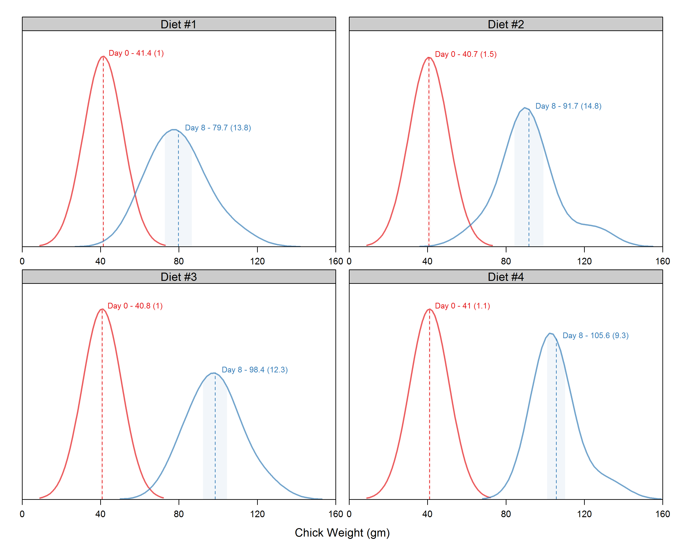

<center> <h2>R Example 0001: Density plot using Lattice</h2> </center> 
<center> <h3>*Becca Krouse, August 31, 2016*</h3> </center> 



### This is a trellis plot of densities by group created using R [Lattice](https://cran.r-project.org/web/packages/lattice/lattice.pdf).  In this example, we compare chick weight between day 0 (birth) and day 8 by diet.

### Features of plot:
1. Use of faceting to show different subsets of the data (condition on diet).
2. Data displayed by group (group by time).
3. Means and intervals for +/- 1 SD are annotated and shaded. 

### Code:
```r
# load packages
pacman::p_load(dplyr, tidyr, lattice, latticeExtra, ggplot2, datasets)

# data - subset to measurements on Days 0 and Day 8
dd <- read.csv('./data/ChickWeight.csv') %>% 
  filter(Time %in% c(0,8)) %>% 
  mutate(Diet = as.factor(Diet))
levels(dd$Diet) <- paste0('Diet #', levels(dd$Diet))

# define colors
pal<-brewer.pal(3,"Set1")
cols<-  c(pal[1],pal[2])
cols2<- c("#E41A1C11","#377EB811")

# define function to caclulate & annotate mean +/- 1 SD in density plot
panel.annotate_density <- function(x, group.number, subscripts){
  
  # Determine mean/SD for filling the Area under the Curve for Mean +/- 1 SD
  mean  <- mean(x,na.rm=T)
  sd    <- sd(x,na.rm=T)
  f    <- 0.5
  d    <- density(x,cut=0.5, bw=10)
  
  # Define position of shaded region
  ytop  <- d$y[d$x<mean+f*sd & d$x>mean-f*sd]
  xtop  <- d$x[d$x<mean+f*sd & d$x>mean-f*sd]
  xx  <- c(mean-f*sd,xtop,mean+f*sd)
  yy  <- c(0,ytop,0)
  
  # Define position of mean line
  diffs  <-abs(d$x-mean)
  lx  <- d$x[diffs==min(diffs)]
  ly  <- d$y[diffs==min(diffs)]
  
  # Shade Mean +/- 1 SD, draw dotted line at Mean, Annotate values
  panel.polygon(x=xx,y=yy,col=cols2[group.number],border=F)
  panel.lines(x=c(lx,lx),y=c(0,ly),col=cols[group.number],lty=2)  
  panel.text(lx,ly,
             labels=paste("Day ",dd[subscripts,]$Time[1]," - ",round(mean(x),1)," (",round(sd(x),1),")",sep=""),
             adj=c(-0.1,-0.1),
             col=cols[group.number],
             cex=0.7)
}


# plot function & output as PNG
png(file='./R-examples/001-density-lattice/001-density-lattice.png',height = 8, width = 10, units = 'in', res = 300)

densityplot(~weight|Diet,   # 1. Condition on diet
            data=dd,  group=Time, #2. Group by time
            alpha=0.7, plot.points=F, bw=10, col=cols, lwd=2,
            as.table=T, between=list(x=1, y=0),
            xlim=c(0, 160), xlab='Chick Weight (gm)',
            ylim=c(0,0.045), ylab='',
            scales=list(alternating=F, tck=c(1,0), axs='i',
                        x=list(relation='free', at=seq(0,160,40)),
                        y=list(tck=c(0,0), labels=NULL)),
            par.settings=list(strip.background=list(col='gray80')),
            panel.groups = function(x, group.number, subscripts, ...) {
              
              # Plot density curves as defined above
              panel.densityplot(x,...)
              
              # Annotate density
              panel.annotate_density(x,group.number, subscripts)
              
            },
            panel = function (x, groups,...){
              panel.superpose(x, groups=groups, ...)
            })

dev.off()
```


