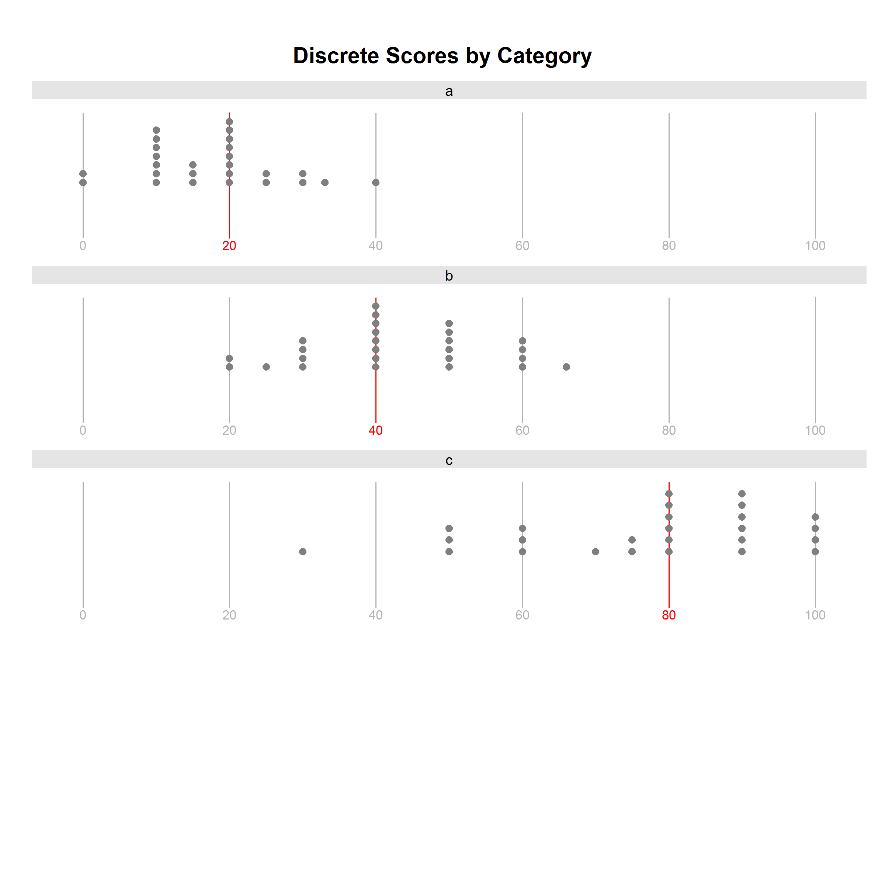

## R Example 002: Dotplot plot using Lattice 
### *Becca Krouse, September 14, 2016* 
  


### This is a trellis plot of dotplots by group created using R [Lattice](https://cran.r-project.org/web/packages/lattice/lattice.pdf).  In this example, we plot discrete x values by category.

### Features of plot:
1. Use of faceting to show different subsets of the data (condition on category).
2. Stack points for a given x value, since we have discrete data
3. Create vertical lines associates with axis tick labels.  Customized lines and labels so they highlight the median values.

### Code:
```r
# load packages
install.packages('pacman')
pacman::p_load(dplyr, tidyr, lattice, latticeExtra, HH)

# read in data
data <- read.csv('./data/discrete_scores.csv')

# 3. Create vertical lines associates with axis tick labels.  
#  Customized lines and labels so they highlight the median values.
#  This is done by by coloring median values red, and the rest gray.
panel.dotplot_highlightMedian <- function(x, l){  # l = vector of axis tick values
  
  panel.segments(l,0.6,l,1.5,col="gray70")          
  panel.text(l,0.55,l,col="gray70",cex=0.7)
  
  panel.segments(quantile(x,0.5,type=4),0.6,quantile(x,0.5,type=4),1.5,col="red")
  panel.text(quantile(x,0.5,type=4),0.55,quantile(x,0.5,type=4),col="red",cex=0.7)
}

# main plot function
dotplot(~score|category, # 1. Facet on category
        data=data, 
        col.symbol="gray50",
        asp=0.2, layout=c(1,4),as.table=T,
        ylab=" ", xlab="", 
        scales=list(x = list(draw=F), y=list(draw=F)),
        par.strip.text = list(cex=0.8),
        par.settings=list(strip.background=list(col="gray90"),
                          axis.line=list(col='transparent'),
                          strip.border=list(col='transparent')),
        main="Discrete Scores by Category",
        prepanel=function(...) list(xlim=c(0,100)),
        panel=function(x,y,...){
          
          # 3. 
          l <- seq(0,100,20)
          panel.dotplot_highlightMedian(x,l)
          
          # 2. Stack points for a given x value, since we have discrete data
          HH::panel.dotplot.tb(x,y,factor=0.5,col.line="transparent",...)
        }                    
)
```