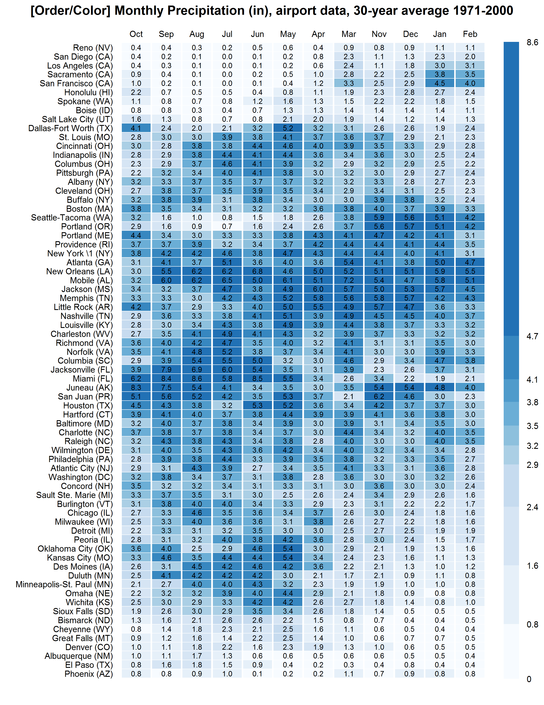

**Title:**  Orderered Precipitation Heatmap

**Languages:** R

**Libraries:** lattice

**Description:** Heatmap with ordered columns and rows using monthly precipitation data   

**Tags:** Ordered, heatmap, annotation

[comment]: <> (---END OF HEADER---)

*A. Calatroni/B Krouse, 2017-01-20* 
  


### Code:
```r


# load packages
pacman::p_load(lattice)
pacman::p_load(RColorBrewer)
pacman::p_load(seriation)

# load data
p <- read.csv(paste0(new_fig_dir,"/Precipitations.csv"), header=F, skip=5, nrows=71)
names(p) <- c("State","City","ST","Code","Jan","Feb","Mar","Apr","May","Jun","Jul","Aug","Sep","Oct","Nov"," Dec","Tot")

# create matrix
p1 <- p[,c(5:16)]
p1 <- as.matrix(p1)
p1 <- t(p1)
colnames(p1) <-  with(p, paste(City," (",ST,")",sep='')) 

# use seriate to calculate dissimilarity
o <- seriate(p1,method= "BEA_TSP")

# plot heatmap w/ ordered columns and rows
levs <- as.vector(quantile(p1,seq(0,1,0.1)))

p <- levelplot(p1[get_order(o, 1),get_order(o,2)],
          as.table=F,aspect="fill",
          scales=list(tck=c(0,0),
                      x=list(alternating=2)),
          shrink = list(x=0.95,y=0.95),,
          xlab="",
          ylab="",
          main="[Order/Color] Monthly Precipitation (in), airport data, 30-year average 1971-2000",
          col.regions = colorRampPalette(brewer.pal(9,"Blues")[1:7])(10),
          colorkey = list(labels = list(at = levs, labels = round(levs,1))),
          at = levs,
          par.settings=list(axis.line=list(col='transparent')),
          panel=function(x, y, z, subscripts,...){
            panel.levelplot(x,y,z,subscripts,...)
            panel.text(x=x[subscripts],y=y[subscripts],lab=format(round(z[subscripts],1),digit=1),cex=0.7)             
          }
)  


```


